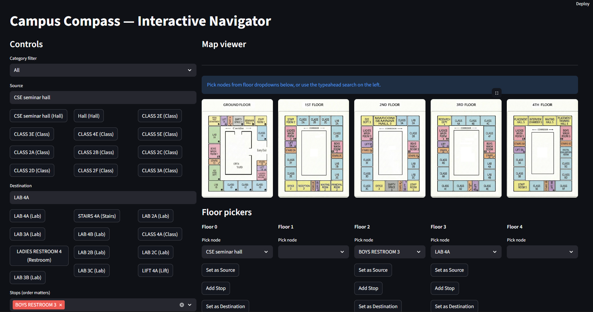
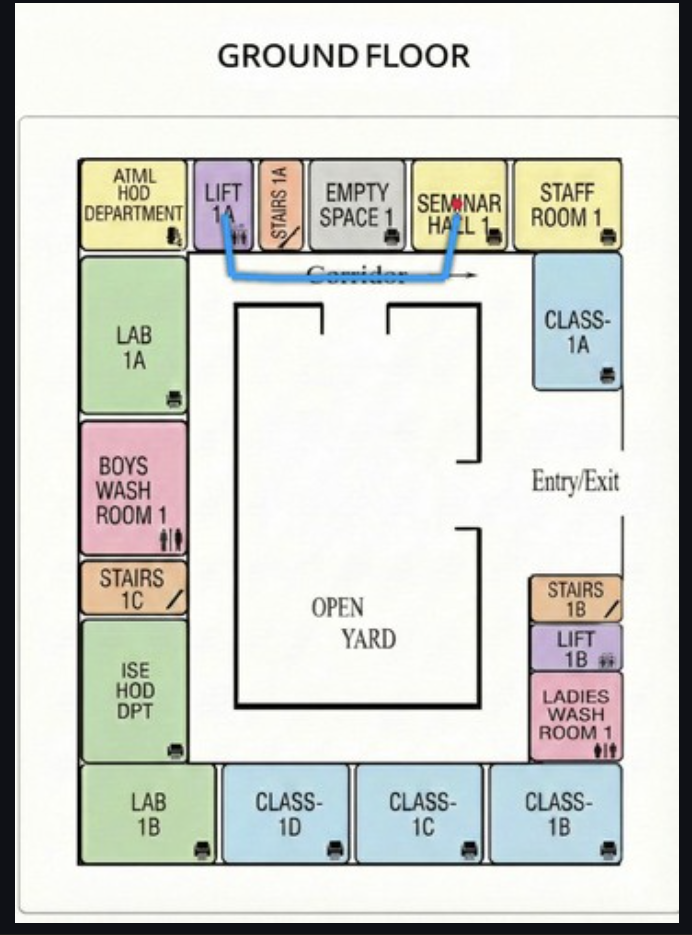
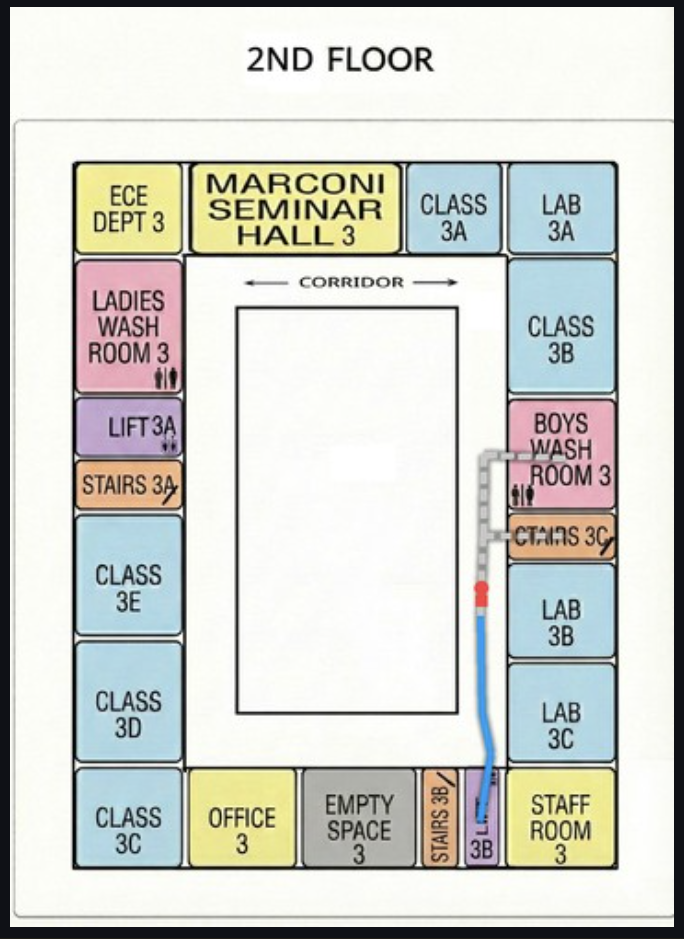

# 🧭 Campus Compass – Smart Indoor Navigation System

Campus Compass is a graph-based indoor navigation system developed to assist users in navigating large campus buildings efficiently. The system computes the shortest path between classrooms, laboratories, offices, and other facilities, and provides an animated visual route with optional voice-guided navigation.

Since GPS performs poorly indoors, Campus Compass models the building as a weighted graph and uses **Dijkstra's Algorithm** to generate accurate routes across multiple floors.

----

## ✨ Features

- Interactive source and destination selection
- Support for multiple intermediate stops
- Multi-floor indoor navigation
- Animated route visualization
- Shortest path computation using Dijkstra's Algorithm
- Optional offline voice-guided navigation
- Automatic floor switching during navigation
- Fuzzy search for room names
- Download route map as an image

----

## 🏗️ System Architecture

```text
User Input
     │
     ▼
Streamlit Frontend
     │
     ▼
Input Validation
     │
     ▼
NetworkX Graph Engine
     │
     ▼
Dijkstra's Algorithm
     │
     ▼
Map Visualization & Voice Guidance
     │
     ▼
Navigation Output
```

----

## 🛠️ Tech Stack

### Programming Language
- Python 3.x

### Frontend
- Streamlit

### Backend
- NetworkX
- Pandas

### Visualization
- Pillow (PIL)

### Voice Navigation
- pyttsx3

### Search
- RapidFuzz

----

## 📚 Libraries Used

| Library | Purpose |
|---------|----------|
| Streamlit | Interactive web interface for the navigation system |
| NetworkX | Graph creation and shortest path computation |
| Pandas | Reading and managing node and edge datasets |
| Pillow (PIL) | Displaying floor maps and drawing navigation paths |
| RapidFuzz | Fuzzy search for location names |
| pyttsx3 | Offline text-to-speech for voice navigation |
| Pickle | Loading the pre-built graph efficiently |
| Math | Distance calculations between nodes |
| Regex (`re`) | Identifying corridor nodes and processing names |
| BytesIO | Image conversion for Streamlit display |
| functools | Callback handling within the application |
| tempfile | Temporary audio file creation |
| os | File and directory handling |
| time | Animation timing and speed control |

----

## 📂 Project Structure

```text
Campus_Compass/
│
├── app.py
├── build_graph.py
├── node_picker.py
├── edge_picker.py
├── path_finder.py
├── map_visualize.py
│
├── nodes.csv
├── edges_by_name.csv
├── graph_by_name.gpickle
│
├── map_floor0.png
├── map_floor1.png
├── map_floor2.png
├── map_floor3.png
├── map_floor4.png
│
├── requirements.txt
└── README.md
```

----

## 📄 Project Files

### `app.py`
The main Streamlit application that provides the user interface, accepts user input, computes routes, displays animated navigation, and provides voice guidance.

### `node_picker.py`
Utility used to create navigation nodes by selecting locations on floor maps. The node coordinates are stored in `nodes.csv`.

### `edge_picker.py`
Utility used to connect nodes by creating edges for same-floor and inter-floor navigation. The generated edges are stored in `edges_by_name.csv`.

### `build_graph.py`
Builds the weighted graph from the node and edge datasets and saves it as `graph_by_name.gpickle`.

### `path_finder.py`
Contains the implementation of Dijkstra's Algorithm to compute the shortest path between the selected source and destination.

### `map_visualize.py`
Responsible for rendering floor maps, drawing navigation paths, animating the route, and displaying markers.

----

## ⚙️ Installation

### Clone the repository

```bash
git clone https://github.com/<your-username>/Campus_Compass.git
cd Campus_Compass
```

### Create a virtual environment

```bash
python -m venv venv
```

### Activate the virtual environment

**Windows**

```bash
venv\Scripts\activate
```

**Linux/macOS**

```bash
source venv/bin/activate
```

### Install dependencies

```bash
pip install -r requirements.txt
```

----

## ▶️ Running the Application

Start the Streamlit application using:

```bash
streamlit run app.py
```

----

## 🗺️ Preparing Navigation Data

### Create Nodes

```bash
python node_picker.py
```

Click on locations in the floor map to generate navigation nodes and save them in `nodes.csv`.

----

### Create Edges

For same-floor connections:

```bash
python edge_picker.py --mode floor --floor 0
```

Replace the floor number as required.

For stairs and lift connections between floors:

```bash
python edge_picker.py --mode inter
```

----

### Build the Navigation Graph

```bash
python build_graph.py
```

This generates the graph file:

```
graph_by_name.gpickle
```

which is loaded by the main application.

----

## 🧠 Algorithm

Campus Compass uses **Dijkstra's Shortest Path Algorithm** to compute the optimal route between locations.

### Why Dijkstra?

- Guarantees the shortest path.
- Supports weighted graphs.
- Efficient for indoor navigation.
- Well-suited for campus routing where distances between locations vary.

----

## 📥 Input

- Source Location
- Destination Location
- Optional Intermediate Stops

----

## 📤 Output

- Shortest navigation route
- Animated path visualization
- Multi-floor navigation
- Voice-guided directions
- Downloadable route image

----

## 📸 Screenshots

### Home Screen



### Path Navigation Animation





----

## 🚀 Future Scope

- Mobile application support
- QR code based indoor positioning
- BLE/Wi-Fi based indoor localization
- Dynamic obstacle avoidance
- Crowd-aware route optimization
- Integration with outdoor GPS navigation

----

## 👥 Team Members

- Aklesh D Shetty
- Abhishesh R Shet
- Shritan S Devadiga
- Adarsh Kumar

----

## 🎓 Academic Information

**Project Title:**  
Campus Compass – Smart Indoor Navigation System for Campus Buildings

**Department:** Artificial Intelligence and Machine Learning

**Institution:** Sir M. Visvesvaraya Institute of Technology, Bengaluru

**University:** Visvesvaraya Technological University (VTU)

**Project Guide:**  
Dr. S. Ambareesh

----

## 📄 License

This project was developed as part of a Bachelor of Engineering (B.E.) academic major project for educational purposes.
